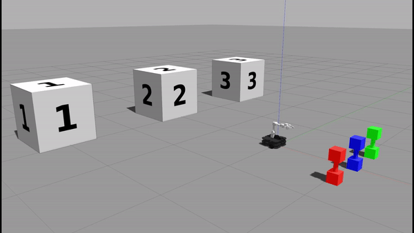
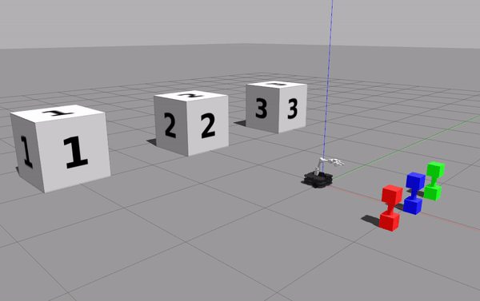

# Q-Learning Project

## Team Members: Joshua Soong, Daria Shifrina

  

## Writeup
### Objectives
In tackling this project, we aimed to create a program that would enable our Turtlebot to place three different-colored dumbbells in front of three different-numbered blocks. Although the robot did not know the correct association between the dumbbells and the blocks, it utilized a q-learning algorithm to determine the correct arrangement and then execute the dumbbell placement.

### High-Level Description
Our program repeatedly queried and received information from outside sources during the course of its reinforcement learning. Specifically, following the concepts of a q-learning algorithm, we posted a randomly selected action to the robot_action topic and received reward information back on the reward topic. To choose the action, we designed several helper functions that first determined which actions were valid from a given state (that is, the existing placement of dumbbells). Reward information was received after every action and this information was immediately logged into our q_matrix. Since the values in the q_matrix were calculated not just from the reward from the immediate state but also from values from one state into the future, the positive reward -- which was only distributed upon the successful placement of all three dumbbells -- slowly trickled down to states where dumbbells were still at the origin (that is, states that had not yet moved all three dumbbells). In this way, our program repeatedly queried the external source in a way that allowed our q_matrix to slowly converge.

Once q matrix converges, we know the pairings for dumbbells and blocks. Within robotmovement.py, our algorithm first figures out the order of the dumbbells (left to right), turns 180 to face the blocks, and figures out their order (left to right). This is done using OpenCV and Kera-OCR. Then it turns back around to face the dumbbells. It goes to the leftmost dumbbell, and using the converged pair, picks it up using arm manipulation and then carries it to the block. It then comes back to the origin, delivers center dumbbell to its pairing, comes back to origin and finishes the last dumbbell-block combo. To navigate around the map, we used the odometry topic to map out the x and y values on the map between which our robot traveled. 

### Q-Learning Algorithm
-   **Action Selection and Execution**
Our action matrix, which stores valid transitions from one state to another, was created by first defaulting the entire matrix to a -1 value (signifying an invalid transition) and then flipping these -1 values to positive values (signifying valid transitions) when such transitions were determined to not involve a) the movement of multiple dumbbells, b) simultaneous placement of dumbbells at multiple blocks, and c) movement of dumbbells back to the origin. Then, our valid_actions() helper function used this action matrix to compile a list of valid actions. Finally, an action was randomly chosen from this list, packaged into a RobotMoveDBToBlock message, and then executed via publishing to the robot_action topic.

-   **Q-Matrix Update**
Our algorithm is divided into two functions, one which selects and publishes the action and the other which serves as the callback to our reward topic subscriber and updates the q-matrix. Upon receiving a reward, the second function (q_algorithm_pt2) calculates the net value following the formula given by the algorithm. Finally, it stores this net value into the appropriate place in the q-matrix and, if the matrix has not converged again, starts another iteration of the algorithm.

-   **Stopping Iteration**
After every iteration of the algorithm, the function has_converged() is called. This function compares the current iteration’s q-matrix to the one from the previous iteration. If the matrices are different, it tells the program to run the algorithm again; if they have converged multiple times, the function sets the flag exit_algo to True which tells the program to exit the algorithm.

-   **Choosing a Path**
Once the q-matrix has converged, the robot_command() function uses the matrix to compile an ordering of the actions the bot should take. Starting first at state 0, the function chooses the action with the highest value and then proceeds to the next state to again choose the highest value. If, in any state, there is a tie between actions with the highest value, the function randomly chooses one to take and uses the chosen action to determine the next state it should look at.

### Robot Perception - robotmovement.py

-   **Numbered Blocks**
We used the keras package recommended in the project instructions. Since we know that the robot is initialized facing the dumbbells, we used a function to turn the robot around 180 degrees and, once this was accomplished, have it feed an image it took of the blocks into the keras model. From this, it is able to recognize the numbers on the leftmost and center blocks and then deduce the third block's number. This is contained in the identity_numbers() function (and its parent function, block_setup()) in our code and this function returns the order of the blocks from left to right.

-   **Colored Dumbbells**
In class 3, we created a line follower robot that followed a yellow line. Since this in-class project required the robot to differentiate below colors, our code extrapolates this color differentiation to tell the red, blue, and green dumbbells apart. This ability is contained within the dumbbell_setup() function. Essentially, we found the HSV ranges for red, green, and blue. Then our function would initially take an image of all the dumbbells and process their x values. It would then sort the order of the blocks based on the x values of the detected center. The leftmost dumbbell would have the lowest x value, and the rightmost the highest. Their colors would be stored as indeces within the self.db_order list.

### Robot Manipulation - robotmovement.py
-   **Moving to Pick the Dumbbell Up**
-   In this phase, the bot first positions and opens its gripper before moving to the dumbbell. Depending on the color, the bot utilizes one of three sister functions (identical in all but the color they look at) to create a color mask to isolate the target dumbbell. Then, the bot uses the find_db() function to slowly edge closer and closer to the dumbbell such that it slides perfectly the pre-positioned arm. This section draws heavily from the in-class project from class3. 

  

-   **Dumbbell Pickup**
As mentioned in the above section, the robot locks its arm into position prior to navigating to the dumbbell. The intuition behind this sequence of movements was to standardize the arm position and robot movement across all dumbbells. The arm position was determined through trial and error and is encoded in the dumbbell_grasp_position() function. We used RViz and arm manipulation gui to test different combinations.

-   **Moving to the Desired Block**
To navigate, the bot relies on travel(), a function leveraging odometry data to determine the bot’s path. Since we know the starting positions of both the blocks and dumbbells, we know the coordinates these entities are at; all that is needed is to determine precisely which of the three blocks and precisely which of the there dumbbells are the bot’s current focus (this is done by passing arguments to travel()). We use the q matrix data to figure out which block to navigate to. Once it attempts to deliver the dumbbell, it travels back to the origin of (0,0) before proceeding to pick up the next dumbbell in its list.

-   **Placing the Dumbbell Down**
This is done by calling the self.dumbbell_grasp_position(), which moves the joint into an outstretched position and opens the grippers. 

### Challenges
We entered several challenges during the course of the project. With regards to algorithm implementation, one challenge we encountered involved the reward topic’s tendency to post an inconsistent number of messages for each iteration (someone else on Slack encountered this problem as well). For example, in the first complete iteration through all three dumbbells, the reward topic might correctly return three distinct rewards. However, in the next iteration, it might return four or even five reward values. To circumnavigate this problem, we compared each reward’s timestamp to the previous reward’s timestamp. Although it is difficult to pinpoint the cause of this inconsistency, we suspect there might be a race condition embedded within our bot’s instructions. Since our program has several rospy.sleep() commands, we knew that we should ignore any reward messages that came too quickly after another one. Using a timestamp difference of 0.08 seconds or greater resolved this issue.

Another challenge we encountered was that the robot would successfully navigate to and pick up a dumbbell, but, after a couple of seconds, the dumbbell would fall out of the robot’s arm. Since the robot did not know this occurred, it would proceed as if nothing had happened. This was frustrating to solve and we resorted to trial and error to determine the arm position that might prevent such a scenario from happening. However, after about 8 hours of testing, we were unsuccessful withi finding a good arm position that would keep the dumbbell secured. We tried the following setups to no avail: holding gripper parallel to the ground, holding gripper perpendicular to the ground, holding gripper diagonally to the ground. The most successful configuration was holding it diagonally and on some runs it even was able to carry one dumbbell to its block destination.

### Future Work
If we have more time, it would have been interesting to optimize our algorithm. As it stands today, our algorithm uses a learning rate and future discount rate of 1. Although these result in the correct placement of dumbbells, we could, in theory, optimize the robot’s path between dumbbells and blocks to minimize the amount of time and the distance it takes to place down all these dumbbells. Within the current program this is arguably a trivial improvement, but such an improvement would be useful if our program was deployed in more complex environments.
 
### Takeaways
- The use of self variables: I still do not fully understand self variables but delineating between “normal” variables and those with the self prefix is important. At certain points, the code was correct in theory but was different in practice because a self variable’s values might be unwittingly changed. We recommend future classmates look into the use of copy.deepcopy() when working with self variables.
- Modular construction: Deploying modular construction to a coding environment is useful not just in writing code but, even more importantly, in debugging. Since this project involves a lot of different components, breaking everything down into smaller helper functions was useful in isolating and fixing bugs.

## Implementation Plan

###   Q-learning algorithm
-   **Executing the Q-learning algorithm**
    

  

We will likely break the algorithm down into smaller helper functions to modularize and compartmentalize each line of the above algorithm (taken from class slides). This will not only make it easier for us to work on each section of the code but crucially will help us isolate problems when we are debugging. To test this, we intend to test each component independently. For example, if we run the first “step” of our algorithm several times, we can expect our robot to move in a randomized fashion each time.

-   **Determining when the Q-matrix has converged**

We will store two states at all times, with state Q1 being an updated state of Q0. We will decide that our Q-matrix has converged after there are no observable changes to the Q-matrix with a new iteration, or when Q1 is almost equal to Q0. It is important to note that there might be instances when there’s no change, but in reality our matrix hasn’t actually converged. At this point, to account for any noise, we will run five additional iterations and verify that the Q-matrix is finalized if no changes occur within those iterations. To test this, we will use a for statement to loop through the iterations’ q-matrices and check that they are identical.

-   **Once the Q-matrix has converged, how to determine which actions the robot should take to maximize expected reward**
    

Once we have completely mapped out our policy, we can use it to determine how the robot should move. Specifically, if our robot finds itself in grid X, we can call grid X from our policy mapping, determine which direction offers the highest reward, and execute an action accordingly. This process can then be repeated for each grid the robot finds itself in. To test this, we can print out the policy mapping and see if the robot’s movements align with the expected action.

### Robot perception
    

**-   Determining the identities and locations of the three colored dumbbells**
    

To determine the location and identity, we will utilize the model_states_received() function along with the LaserScan and Camera topics. We will be basing this off of the class meeting 3 code. First, we will make a subscriber for ‘camera/rgb/image_raw’ and then convert the incoming ROS messages to OpenCV format and HSV. Given the HSV, we’ll convert it for the different color channels to distinguish the dumbbells.

  

 1. *HSV red*: lower bound [80,70,50], upper bound [100, 255, 255]
    
 2.  *HSV blue*: lower bound [110,50,50], upper bound [130,255,255]
    
   3. *HSV green*: lower bound [50,100,100], upper bound [70,255,255]

Using moments, we will determine the center of the colored pixels and get an estimated movie for the LaserScan location. To test this, we can implement print statements that output the color the robot sees when in front of a dumbbell ( and see if this conforms with what we see in the RViz camera).

-   **Determining the identities and locations of the three numbered blocks**
    

We intend to use the OpenCV and Python Tesseract libraries along with Camera to recognize the digits on the blocks. Python-tesseract is a wrapper for Google’s Tesseract-OCR Engine which is used to recognize text from images. We will use the same subscriber from dumbbell detection, get incoming ROS messages and use OpenCV to narrow down the black text region. Then, using Python Tesseract, we will translate the detected text into a number. For this to properly work, our bot will detect each block using LaserScan and position itself directly in front of them to get a 2D image. To test this, we can give our code a selection of test images and see if it can then correctly identify the text.

### Robot manipulation & movement
    

-   **Picking up and putting down the dumbbells with the OpenMANIPULATOR arm**
    

Since we know that the claw needs to be perpendicular to the dumbbell to pick it up and that our robot will be near the dumbbell before attempting to pick it up, we can employ inverse kinematics to determine the optimal joint angles. Additionally, when the robot is not holding a dumbbell we will have the claw fully open (and when it wants to hold a dumbbell it will close its claw). To test this, we can initialize the robot next to a dumbbell and see whether or not it successfully picks up (and puts down) the dumbbell.

-   **Navigating to the appropriate locations to pick up and put down the dumbbells**
    

We can navigate to the appropriate location using our action matrix, which can be populated with information from our converged q-learning algorithm. If needed, we can also use information from our LIDAR scan to ensure our robot does not crash into anything when executing instructions from the action matrix. To test this, we can print out our Q-matrix and actio matrix, use these to determine which action the robot should be taking, and visually check whether the robot is indeed following the expected instructions.

### Timeline
    

-   February 21: complete Q algorithm and robot dumbbell detection.
    
-   February 24: complete robot perception, incorporate both dumbbell and block detection.
    
-   February 26: complete robot manipulation & movement.
    

-   February 27: writeup. Record gif and rosbag.
    

-   February 28: finalize writeup. submit everything.
